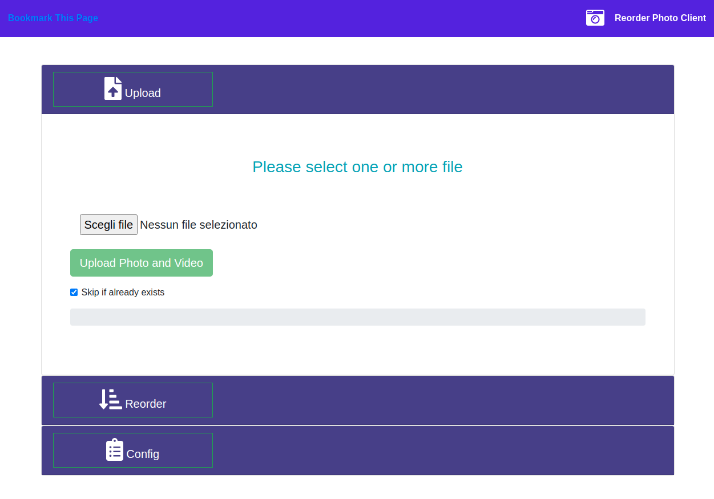

# SpringServiceNAS
Exploring SpringBoot, Angular and Bootstrap. With JPA and some AOP.

This simple project is an example of using SpringBoot, Angular and Bootstrap. With the complication of 
JPA and a brief mention of AOP (aspect oriented programming).

The basic idea is to have one or more micro services running on the home NAS. One of these is used to 
upload photos and videos directly to the NAS via web application. Then the photos and videos are 
reorganized according to the <year> / <month> logic.

Two micro services are performed that communicate with each other with synchronous messages via AOP. 
One micro service takes care of saving information in an H2 db, while the other uploads files, 
typically photos and videos. 
There is also a third micro service used to present a simple angular web app to actually (multiple file) upload.

example client app on #http://your_nas_ip:8888

NOTE: to compile the web app it is necessary to update the folder "SpringServiceWebPhotoClient/client/app-photo-client/src/assets/libs" with Bootstrap, JQuery and Animate.css.
